# 代码随想录笔记

## Intro

这个文档是《代码随想录——跟着Carl学算法》的学习笔记。

[toc]

## 20220404 3.1-3.2

### 3.1 20220404

P35代码

```c++
#include <iostream>

using namespace std;

void test_arr() {
    int array[2][3] = {
            {0, 1, 2},
            {3, 4, 5}
    };
    cout << &array[0][0] << " " << &array[0][1] << " " << &array[0][2] << endl;
    cout << &array[1][0] << " " << &array[1][1] << " " << &array[1][2] << endl;
}

int main() {
    test_arr();
}
```

执行结果
> 0x7ff7b869d5d0 0x7ff7b869d5d4 0x7ff7b869d5d8
> 0x7ff7b869d5dc 0x7ff7b869d5e0 0x7ff7b869d5e4

可以看出每个int占据4字节，所以相邻元素是连续的

### 3.2 [704. Binary Search](https://leetcode-cn.com/problems/binary-search/) 20220404

二分查找虽然比较简单，但是也要仔细考虑边界条件。题目中是有序无重复的数组，因此可用二分法。

```c++
class Solution {
public:
    int search(vector<int>& nums, int target) {
        int left = 0;
        int right = nums.size() - 1;
        while (left <= right) {
            //这种写法是为了防止溢出，效果等同于(left + right) / 2
            int middle = left + ((right - left) / 2);
            if (nums[middle] > target) {
                right = middle - 1;
            } else if (nums[middle] < target) {
                left = middle + 1;
            } else {
                return middle;
            }
        }
        return -1;
    }
};
```

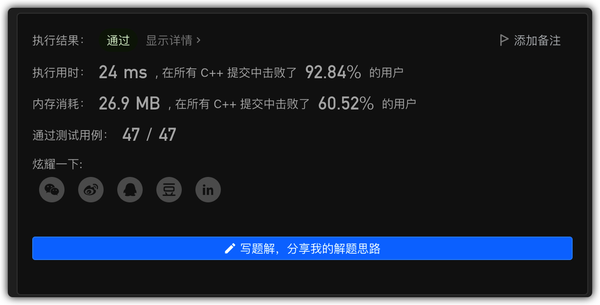

### 3.3 [27. Remove Element](https://leetcode-cn.com/problems/remove-element/) 20220405

这道题首先想到的就是暴力解法，两遍for循环，第一遍找到要删除的数字，嵌套的for负责把后面的元素踢到前面来。但是这个方法有点笨，因此使用双指针法：通过一个快指针和一个慢指针在一个for里完成两个for的工作。

```c++
class Solution {
public:
    int removeElement(vector<int>& nums, int val) {
        int slowIndex = 0;
        for (int fastIndex = 0; fastIndex < nums.size(); fastIndex++) {
            if (val != nums[fastIndex]) {
                nums[slowIndex++] = nums[fastIndex];
            }
        }
        return slowIndex;
    }
};
```

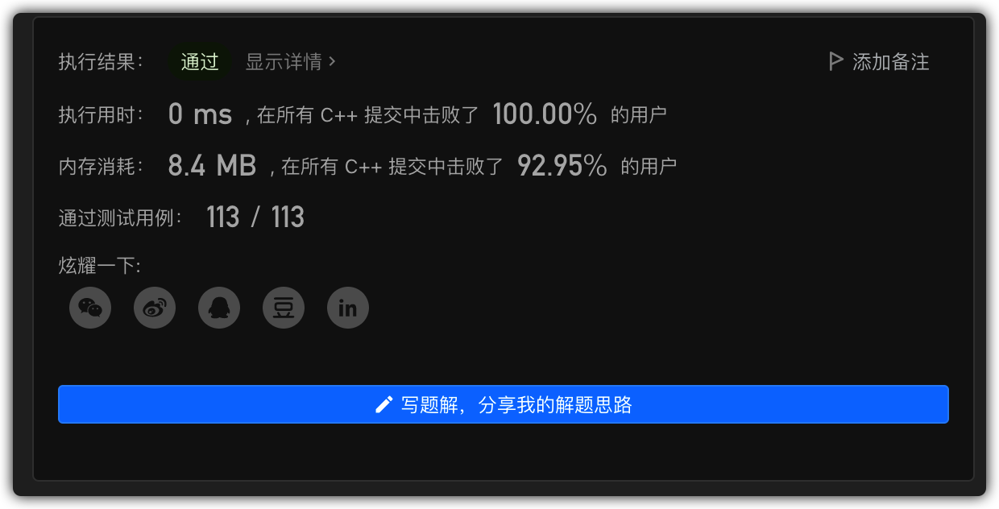

### 3.4 [209. Minimum Size Subarray Sum](https://leetcode-cn.com/problems/minimum-size-subarray-sum/) 20220406

暴力法使用两个for循环，反复寻找符合条件的子数组。也可以使用滑动窗口，也就是不断调整数组的起始位置和终止位置，来获得想要的结果。滑动窗口可以理解为是双指针法的一种。可以把复杂度从平方级下降到n级别：

```c++
class Solution {
public:
    int minSubArrayLen(int target, vector<int>& nums) {
        int result = INT32_MAX;
        int sum = 0;
        int i = 0;
        int subLength = 0;
        for (int j = 0; j < nums.size(); j++) {
            sum += nums[j];
            while (sum >= target) {
                subLength = (j - i + 1);
                result = result < subLength ? result : subLength;
                // 这里是这个滑动窗口的精髓，不断变更i（窗口的起始位置）
                sum -= nums[i++];
            }
        }
        return result == INT32_MAX ? 0 : result;
    }
};
```

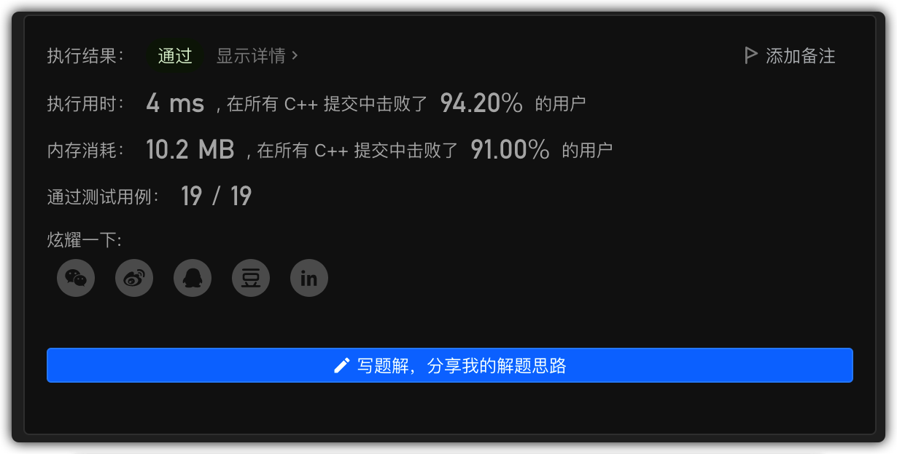

### 3.5 [59. Spiral Matrix II](https://leetcode-cn.com/problems/spiral-matrix-ii/) 20220407

这道题需要注意的是，要么左闭右开，要么左开右闭。千万不能乱了。

```c++
class Solution {
public:
    vector<vector<int>> generateMatrix(int n) {
        vector<vector<int>> res(n, vector<int>(n, 0));
        int startx = 0, starty = 0;
        int loop = n / 2;
        int mid = n / 2;
        int count = 1;
        int offset = 1;
        int i, j;
        while (loop--) {
            i = startx;
            j = starty;
            for (j = starty; j < starty + n - offset; j++) {
                res[startx][j] = count++;
            }
            for (i = startx; i < startx + n - offset; i++) {
                res[i][j] = count++;
            }
            for (; j >starty; j--) {
                res[i][j] = count++;
            }
            for(; i > startx; i--) {
                res[i][j] = count++;
            }
            startx++;
            starty++;
          	// offset用于控制每一圈中每一条边遍历的长度
            offset += 2;
        }
        if (n % 2) {
            res[mid][mid] = count;
        }
        return res;
    }
};
```


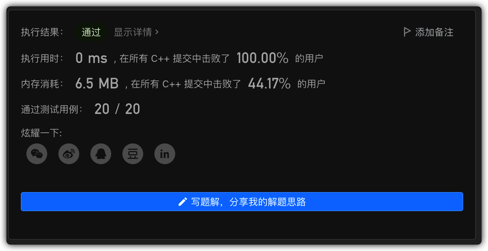

### 4.1-4.2 [203. Remove Linked List Elements](https://leetcode-cn.com/problems/remove-linked-list-elements/) 20220408

今天是一道基础的删除链表中的节点的题。通过设置一个虚拟的头节点，讲所有删除的操作都统一起来。

```c++
/**
 * Definition for singly-linked list.
 * struct ListNode {
 *     int val;
 *     ListNode *next;
 *     ListNode() : val(0), next(nullptr) {}
 *     ListNode(int x) : val(x), next(nullptr) {}
 *     ListNode(int x, ListNode *next) : val(x), next(next) {}
 * };
 */
class Solution {
public:
    ListNode* removeElements(ListNode* head, int val) {
        ListNode* dummyHead = new ListNode(0);
        dummyHead->next = head;
        ListNode* cur = dummyHead;
        while (cur->next != NULL) {
            if (cur->next->val == val) {
                ListNode* tmp = cur->next;
                cur->next = cur->next->next;
                delete tmp;
            } else {
                cur = cur->next;
            }
        }
        head = dummyHead->next;
        delete dummyHead;
        return head;

    }
};
```

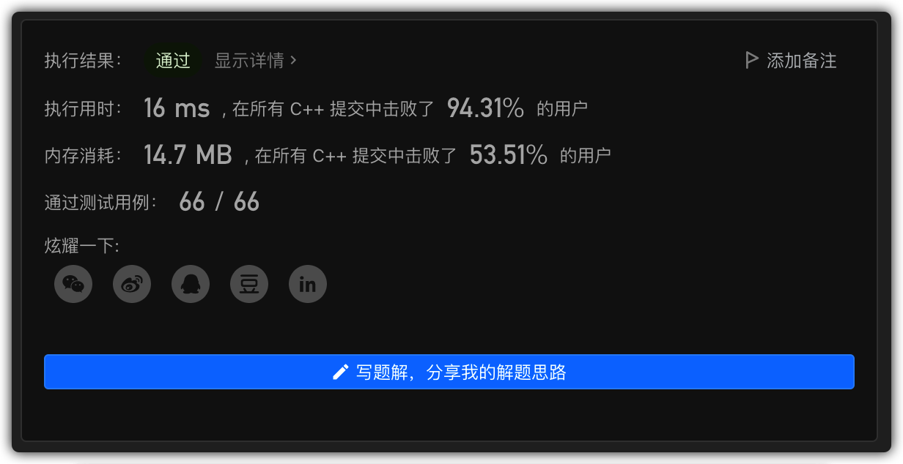

### 20220411 4.3 [707. Design Linked List](https://leetcode-cn.com/problems/design-linked-list/)

```c++
class MyLinkedList {
public:
    struct LinkedNode {
        int val;
        LinkedNode* next;
        LinkedNode(int val) : val(val), next(nullptr) { }
    };

    MyLinkedList() {
        _dummyHead = new LinkedNode(0);
        _size = 0;
    }
    
    int get(int index) {
        if (index > (_size - 1) || index < 0) {
            return -1;
        }
        LinkedNode* cur = _dummyHead->next;
        while(index--) {
            cur = cur->next;
        }
        return cur->val;
    }
    
    void addAtHead(int val) {
        LinkedNode* newNode = new LinkedNode(val);
        newNode->next = _dummyHead->next;
        _dummyHead->next = newNode;
        _size++;
    }
    
    void addAtTail(int val) {
        LinkedNode* newNode = new LinkedNode(val);
        LinkedNode* cur = _dummyHead;
        while (cur->next != nullptr) {
            cur = cur->next;
        }
        cur->next = newNode;
        _size++;
    }
    
    void addAtIndex(int index, int val) {
        if (index > _size) {
            return;
        }
        LinkedNode* newNode = new LinkedNode(val);
        LinkedNode* cur = _dummyHead;
        while (index--) {
            cur = cur->next;
        }
        newNode->next = cur->next;
        cur->next = newNode;
        _size++;
    }
    
    void deleteAtIndex(int index) {
        if (index >= _size || index < 0) {
            return;
        }
        LinkedNode* cur = _dummyHead;
        while (index--) {
            cur = cur->next;
        }
        LinkedNode* tmp = cur->next;
        cur->next = cur->next->next;
        delete tmp;
        _size--;
    }
 private:
    int _size;
    LinkedNode* _dummyHead;
};

/**
 * Your MyLinkedList object will be instantiated and called as such:
 * MyLinkedList* obj = new MyLinkedList();
 * int param_1 = obj->get(index);
 * obj->addAtHead(val);
 * obj->addAtTail(val);
 * obj->addAtIndex(index,val);
 * obj->deleteAtIndex(index);
 */
```

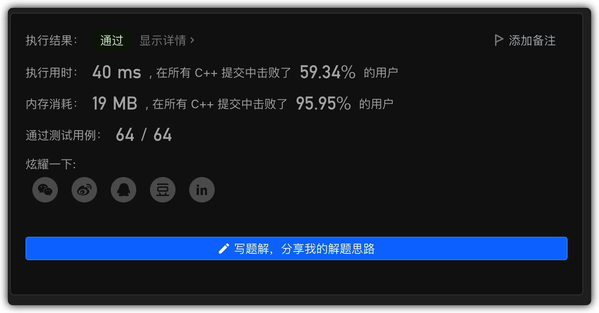

今天这道题相当于自己完整写一个链表和处理逻辑，整体难度不高，但是有一些细节需要处理，如对于非法值的处理等等。

### 20220412 4.4 [206. Reverse Linked List](https://leetcode-cn.com/problems/reverse-linked-list/)

```c++
class Solution {
public:
    ListNode* reverseList(ListNode* head) {
        ListNode* tmp;
        ListNode* cur = head;
        ListNode* pre = nullptr;
        while (cur) {
            tmp = cur->next;
            cur->next = pre;
            pre = cur;
            cur = tmp;
        }
        return pre;

    }
};
```


今天是一道反转链表的题目，只要注意处理好循环中值得条件即可，难度不大。1⃣️让tmp=cur的下一个节点2⃣️让cur的下一个节点变成pre3⃣️将pre移动至cur4⃣️将cur移动至tmp

### 20220413 4.5 [19. Remove Nth Node From End of List](https://leetcode-cn.com/problems/remove-nth-node-from-end-of-list/)

```c++
class Solution {
public:
    ListNode* removeNthFromEnd(ListNode* head, int n) {
        ListNode* dummyHead = new ListNode(0);
        dummyHead->next = head;
        ListNode* slow = dummyHead;
        ListNode* fast = dummyHead;
        while(n-- && fast != nullptr) {
            fast = fast->next;
        }
        fast = fast->next;
        while (fast != nullptr){
            fast = fast->next;
            slow = slow->next;
        }
        slow->next = slow->next->next;
        return dummyHead->next;
    }
};
```

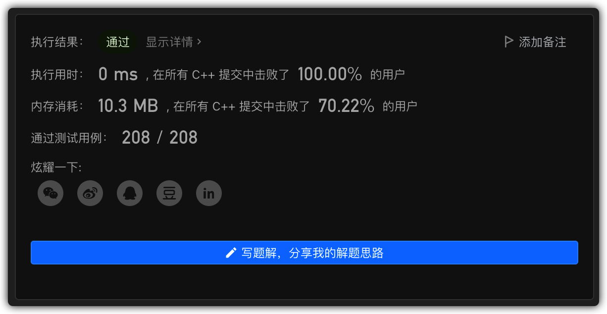

今天这道题做法很神奇，使用双指针，先让fast移动N步，随后让fast和slow同时移动，直到fast到达链表末尾。

### 20220414 4.6 [142. Linked List Cycle II](https://leetcode-cn.com/problems/linked-list-cycle-ii/)

```c++
class Solution {
public:
    ListNode *detectCycle(ListNode *head) {
        ListNode* fast = head;
        ListNode* slow = head;
        while (fast != nullptr && fast->next != nullptr) {
            slow = slow->next;
            fast = fast->next->next;
            if (slow == fast) {
                ListNode* index1 = fast;
                ListNode* index2 = head;
                while (index1 != index2) {
                    index1 = index1->next;
                    index2 = index2->next;
                }
                return index2;
            }
        }
        return nullptr;
    }
};
```

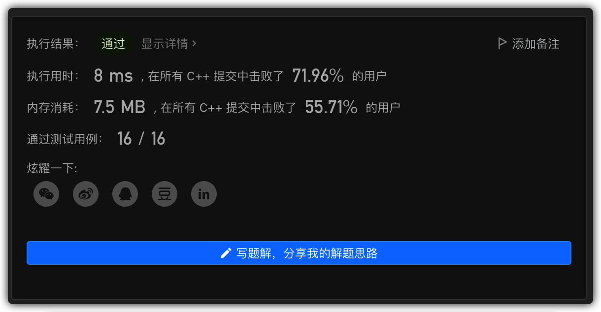

这道题还需要一些数学知识。首先使用快慢指针判断是否存在环。然后通过简单的数学计算相遇位置和head位置的相对关系。 详情见书P66。

### 20220415 5.1 5.2 [242. Valid Anagram](https://leetcode-cn.com/problems/valid-anagram/)

```c++
class Solution {
public:
    bool isAnagram(string s, string t) {
        int record[26] = {0};
        for (int i = 0; i < s.size(); i++) {
            record[s[i] - 'a']++;
        }
        for (int i = 0; i < t.size(); i++) {
            record[t[i] - 'a']--;
        }
        for (int i = 0; i < 26; i++) {
            if (record[i] != 0) {
                return false;
            }
        }
        return true;
    }
};
```

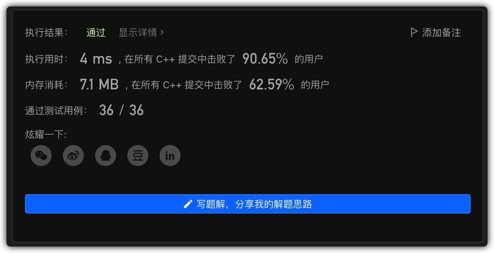

今天这道题蛮简单的，就是拉一个hash table看看有没有重复和冲突。没有就返回true

### 20220418 5.3 [349. Intersection of Two Arrays](https://leetcode-cn.com/problems/intersection-of-two-arrays/)

```c++
class Solution {
public:
    vector<int> intersection(vector<int>& nums1, vector<int>& nums2) {
        unordered_set<int> result_set;
        unordered_set<int> nums_set(nums1.begin(), nums1.end());
        for (int num: nums2) {
            if (nums_set.find(num)!= nums_set.end()){
                result_set.insert(num);
            }
        }
        return vector<int>(result_set.begin(),result_set.end());
    }
};
```

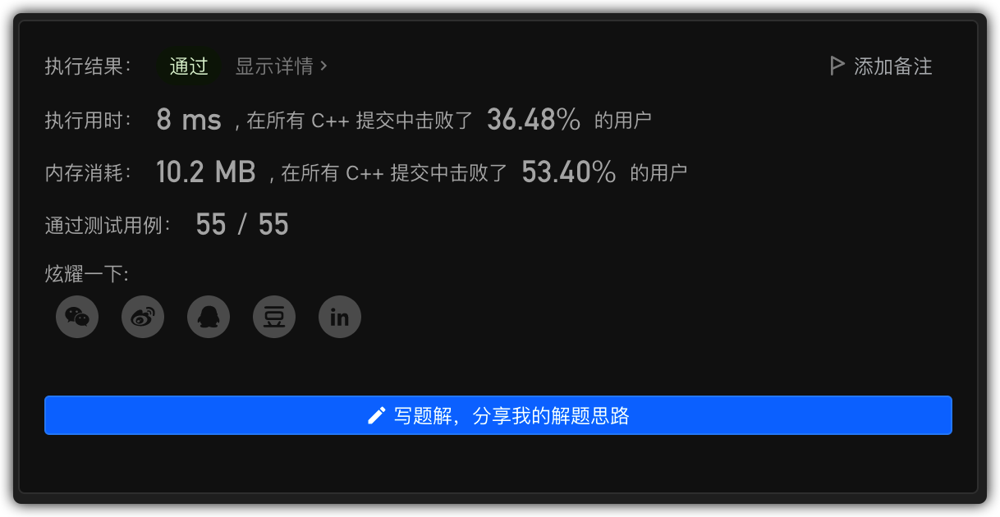

今天这道题利用hash table就可以很方便的做出来。

### 20220419 5.4 [1. Two Sum](https://leetcode-cn.com/problems/two-sum/)

```c++
class Solution {
public:
    vector<int> twoSum(vector<int>& nums, int target) {
        unordered_map<int, int> map;
        for (int i = 0; i < nums.size(); i++) {
            auto iter = map.find(target - nums[i]);
            if (iter != map.end()) {
                return {iter->second, i};
            }
            map.insert(pair<int, int> (nums[i],i));
        }
        return {};
    }
};
```

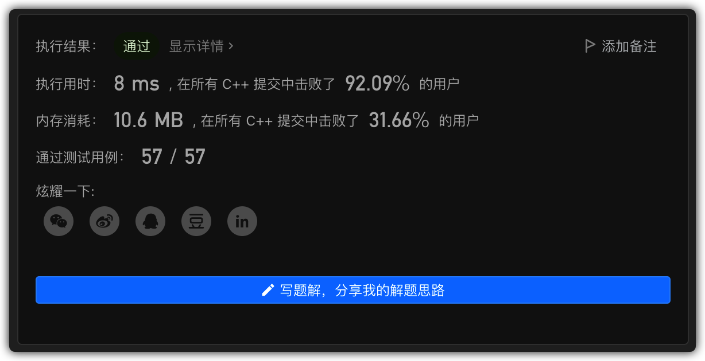

本题用map而不用set 的原因：set是一个集合，里面放的元素只能是一个key，但是本题不光要判断y是否存在，还要记住y的位置，map是<key, value>的结构，可以保存值的同时也保留下标。

### 20220420 5.5 [454. 4Sum II](https://leetcode-cn.com/problems/4sum-ii/)

```c++
class Solution {
public:
    int fourSumCount(vector<int>& nums1, vector<int>& nums2, vector<int>& nums3, vector<int>& nums4) {
        unordered_map<int, int> umap;
        for (int a : nums1) {
            for (int b : nums2) {
                umap[a + b]++;
            }
        }
        int count = 0;
        for (int c : nums3) {
            for (int d : nums4) {
                if (umap.find(0 - (c + d)) != umap.end()) {
                    count += umap[0 - (c + d)];
                }
            }
        }
        return count;
    }
};
```

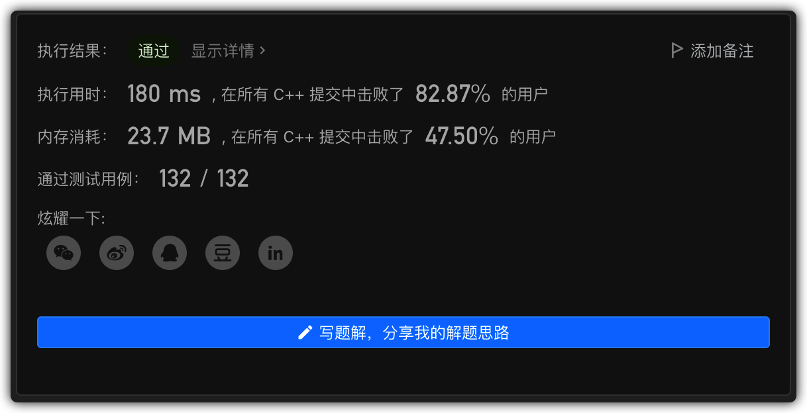

把nums1、nums2算成第一组，nums3、nums4算成第二组，这样就把这个题转换成第一1题的解决方法。

### 20220421 5.6 [15. 3Sum](https://leetcode-cn.com/problems/3sum/)

```c++
class Solution {
public:
    vector<vector<int>> threeSum(vector<int>& nums) {
        vector<vector<int>> result;
        sort(nums.begin(), nums.end());
        for (int i = 0; i < nums.size(); i++) {
            if (nums[i] > 0) {
                return result;
            }
            if (i > 0 && nums[i] == nums[i - 1]) {
                continue;
            }
            int left = i + 1;
            int right = nums.size() - 1;
            while (right > left) {
                if (nums[i] + nums[left] + nums[right] > 0) {
                    right--;
                } else if (nums[i] + nums[left] + nums[right] < 0) {
                    left++;
                } else {
                    result.push_back(vector<int>{nums[i], nums[left], nums[right]});
                    while (right >left && nums[right] == nums[right - 1]) {
                        right--;
                    }
                    while (right >left && nums[left] == nums[left + 1]) {
                        left++;
                    }
                    right--;
                    left++;
                }
            }
        }
        return result;
    }
};
```


这道题和偶数个数字求和有所不同，如果仍然用hash法就会非常复杂。因此本题使用了双指针法。首先将整个数组排序。如果nums[i]+nums[left]+nums[right]大了，那就让right往左移动。如果小了，就让left往右移动，知道left和right相遇。将i遍历一遍之后，就可以获得所有规定的数字了。

### 20220422 5.7 [18. 4Sum](https://leetcode-cn.com/problems/4sum/)

```c++
class Solution {
public:
    vector<vector<int>> fourSum(vector<int>& nums, int target) {
        vector<vector<int>> result;
        sort(nums.begin(), nums.end());
        for (int k = 0; k < nums.size(); k++) {
            if (k > 0 && nums[k] == nums[k - 1]) {
                continue;
            }
            for (int i = k + 1; i < nums.size(); i++) {
                if (i > k + 1 && nums[i] == nums[i - 1]) {
                    continue;
                }
                int left = i + 1;
                int right = nums.size() - 1;
                while (right > left) {
                    if (nums[k] + nums[i] > target - (nums[left] + nums[right])) {
                        right--;
                    } else if (nums[k] + nums[i] < target - (nums[left] + nums[right])) {
                        left++;
                    } else {
                        result.push_back(vector<int>{nums[k], nums[i], nums[left], nums[right]});
                        while (right > left && nums[right] == nums[right - 1]) right--;
                        while (right > left && nums[left] == nums[left + 1]) left++;
                        right--;
                        left++;
                    }
                }
            }
        }
        return result;
    }
};
```

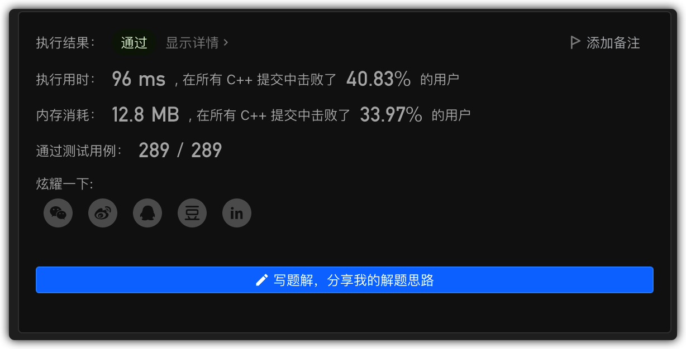

这道题和昨天那道题有点像，都可以用双指针解决，不同的是，这次套了两次循环。

### 20220425 6.1 6.2 [344. Reverse String](https://leetcode-cn.com/problems/reverse-string/)

```c++
class Solution {
public:
    void reverseString(vector<char>& s) {
        for (int i = 0, j = s.size() - 1; i < s.size()/2; i++, j--) {
            swap(s[i], s[j]);
        }
    }
};
```

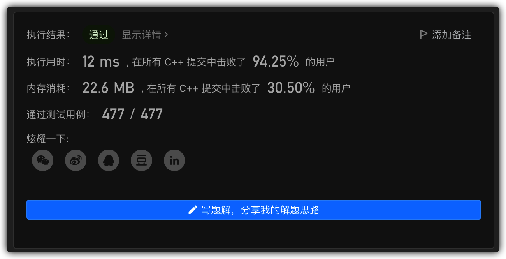

类似前几天的链表反转，但是字符串原则是数组，直接按下表形成“双指针”，来反转就可以了。

### 20220426 6.3 [541. Reverse String II](https://leetcode-cn.com/problems/reverse-string-ii/)

```c++
class Solution {
public:
    string reverseStr(string s, int k) {
        for (int i = 0; i < s.size(); i += (2 * k)) {
            if ( i + k <= s.size()) {
                reverse(s.begin() + i, s.begin() + i + k);
                continue;
            }
            reverse(s.begin() + i, s.begin() + s.size());
        }
        return s;
    }
};
```

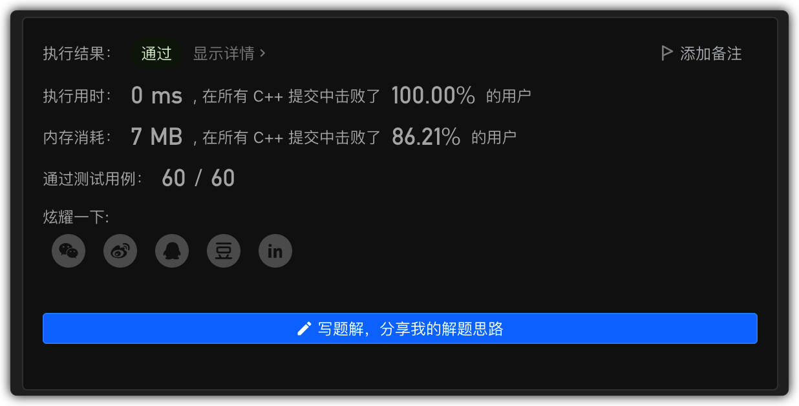

这道题就是把昨天的字符串反转在局部实现了。在for上进行控制就可以。

### 20220427 6.4 [151. Reverse Words in a String](https://leetcode-cn.com/problems/reverse-words-in-a-string/)

```c++
class Solution {
public:
    void reverse(string& s, int start, int end) {
        for (int i = start, j = end; i < j; i++, j--) {
            swap(s[i], s[j]);
        }
    }
    void removeExtraSpaces(string& s) {
        int slowIndex = 0, fastIndex = 0;
        while (s.size() > 0 && fastIndex < s.size() && s[fastIndex] == ' ') {
            fastIndex++;
        }
        for (; fastIndex < s.size(); fastIndex++) {
            if (fastIndex - 1 > 0 && s[fastIndex - 1] == s[fastIndex] && s[fastIndex] == ' ') {
                continue;
            } else {
                s[slowIndex++] = s[fastIndex];
            }
        }
        if (slowIndex - 1 > 0 && s[slowIndex - 1] == ' ') {
            s.resize(slowIndex - 1);
        } else {
            s.resize(slowIndex);
        }
    }
    string reverseWords(string s) {
        removeExtraSpaces(s);
        reverse(s, 0, s.size() - 1);
        int start = 0;
        int end = 0;
        bool entry = false;
        for (int i = 0; i < s.size(); i++) {
            if ((!entry) || (s[i] != ' ' && s[i - 1] == ' ')) {
                start = i;
                entry = true;
            }
            if (entry && s[i] == ' ' && s[i - 1] != ' ') {
                end = i - 1;
                entry = false;
                reverse(s, start, end);
            }
            if (entry && (i == (s.size() - 1)) && s[i] != ' ') {
                end = i;
                entry = false;
                reverse(s, start, end);
            }
        }
        return s;

    }
};
```

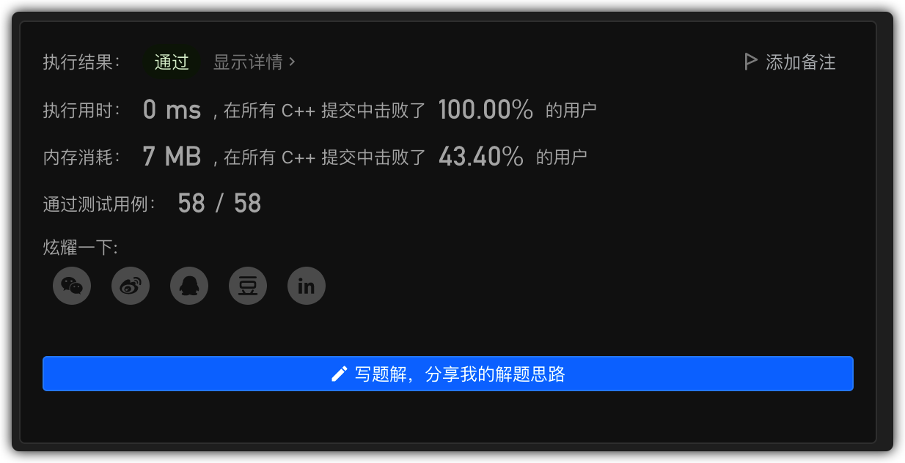

思路：1.删除多余的空格。2.字符串反转。3.单词反转

### 20220428 6.5 KMP算法理论

前缀表：

前缀：包含首字母，不包含尾字母的所有子串

后缀：只包含尾字母，不包含首字母的所有子串

求：最长相等前后缀

例如：aabaaf的最长相等前后缀

| 字符串 | 最长相等前后缀长度 |
| ------ | ------------------ |
| a      | 0                  |
| aa     | 1                  |
| aab    | 0                  |
| aaba   | 1                  |
| aabaa  | 2                  |
| aabaaf | 0                  |

模式串

| 0    | 1    | 2    | 3    | 4    | 5    |
| ---- | ---- | ---- | ---- | ---- | ---- |
| a    | a    | b    | a    | a    | f    |
| 0    | 1    | 0    | 1    | 2    | 0    |

### 20220429 6.6 [28. Implement strStr()](https://leetcode-cn.com/problems/implement-strstr/)

```c++
class Solution {
public:
    void getNext(int* next, const string& s) {
        int j = 0;
        next[0] = 0;
        for(int i = 1; i < s.size(); i++) {
            while (j > 0 && s[i] != s[j]) {
                j = next[j - 1];
            }
            if (s[i] == s[j]) {
                j++;
            }
            next[i] = j;
        }
    }
    int strStr(string haystack, string needle) {
        if (needle.size() == 0) {
            return 0;
        }
        int next[needle.size()];
        getNext(next, needle);
        int j = 0;
        for (int i = 0; i < haystack.size(); i++) {
            while (j > 0 && haystack[i] != needle[j]) {
                j = next[j - 1];
            }
            if (haystack[i] == needle[j]) {
                j++;
            }
            if (j == needle.size()) {
                return (i - needle.size() + 1);
            }
        }
        return -1;
    }
};
```


今天这道题实践了昨天的KMP算法。

### 20220502 6.7 [459. Repeated Substring Pattern](https://leetcode-cn.com/problems/repeated-substring-pattern/)

```c++
class Solution {
public:
    void getNext(int* next, const string& s) {
        next[0] = -1;
        int j = -1;
        for (int i = 1; i < s.size(); i++) {
            while (j > 0 && s[i] != s[j + 1]) {
                j = next[j];
            }
            if (s[i] == s[j + 1]) {
                j++;
            }
            next[i] = j;
        }
    }
    bool repeatedSubstringPattern(string s) {
        if (s.size() == 0) {
            return false;
        }
        int next[s.size()];
        getNext(next, s);
        int len = s.size();
        if (next[len - 1] != -1 && len % (len - (next[len - 1] + 1)) == 0) {
            return true;
        }
        return false;
    }
};
```

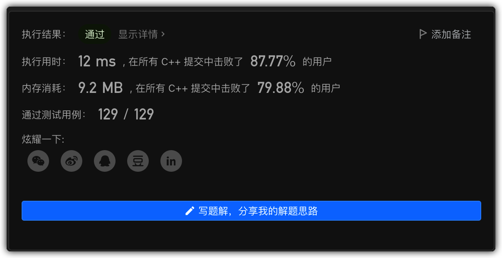

这道题乍看上去想不到和KMP算法的联系，但是KMP算法的本质不就是用来寻找重复的子串吗。因此用KMP算法可以方便的解决本题。

### 20220503 7.1 7.2 [232. Implement Queue using Stacks](https://leetcode-cn.com/problems/implement-queue-using-stacks/)

```c++
class MyQueue {
public:
    stack<int> stIn;
    stack<int> stOut;

    MyQueue() {

    }
    
    void push(int x) {
        stIn.push(x);
    }
    
    int pop() {
        if (stOut.empty()) {
            while (!stIn.empty()) {
                stOut.push(stIn.top());
                stIn.pop();
            }
        }
        int result = stOut.top();
        stOut.pop();
        return result;
    }
    
    int peek() {
        int res = this->pop();
        stOut.push(res);
        return res;
    }
    
    bool empty() {
        return stIn.empty() && stOut.empty();
    }
};
```


在工业级应用中，一定要注意代码的复用，尽量避免重复造轮子。

### 20220504 7.3 [225. Implement Stack using Queues](https://leetcode-cn.com/problems/implement-stack-using-queues/)

```c++
class MyStack {
public:
    queue<int> que1;
    queue<int> que2;
    MyStack() {

    }
    
    void push(int x) {
        que1.push(x);
    }
    
    int pop() {
        int size = que1.size();
        size--;
        while (size--) {
            que2.push(que1.front());
            que1.pop();
        }
        int result = que1.front();
        que1.pop();
        que1 = que2;
        while (!que2.empty()) {
            que2.pop();
        }
        return result;
    }
    
    int top() {
        return que1.back();
    }
    
    bool empty() {
        return que1.empty();
    }
};
```

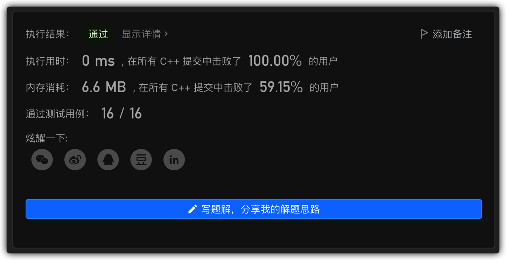

利用队列实现栈

### 20220505 7.4 [20. Valid Parentheses](https://leetcode-cn.com/problems/valid-parentheses/)

```c++
class Solution {
public:
    bool isValid(string s) {
        stack<char> parsed;
        for (int i = 0; i < s.length(); ++i) {
            if (s[i] == '{' || s[i] == '[' || s[i] == '(') {
                parsed.push(s[i]);
            } else {
                if (parsed.empty()) {
                    return false;
                }
                char c = parsed.top();
                if ((s[i] == '}' && c == '{') ||
                    (s[i] == ']' && c == '[') ||
                    (s[i] == ')' && c == '(')) {
                        parsed.pop();
                    } else {
                        return false;
                    }
            }
        }
        return parsed.empty();
    }
};
```

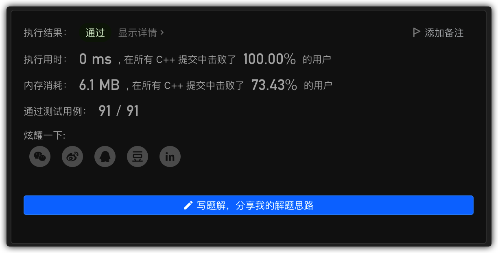

### 20220506 7.5 [150. Evaluate Reverse Polish Notation](https://leetcode-cn.com/problems/evaluate-reverse-polish-notation/)

```c++
class Solution {
public:
    int evalRPN(vector<string>& tokens) {
        stack<int> st;
        for (int i = 0; i < tokens.size(); i++) {
            if (tokens[i] == "+" || tokens[i] == "-" || tokens[i] == "*" || tokens[i] == "/") {
                int num1 = st.top();
                st.pop();
                int num2 = st.top();
                st.pop();
                if (tokens[i] == "+") st.push(num2 + num1);
                if (tokens[i] == "-") st.push(num2 - num1);
                if (tokens[i] == "*") st.push(num2 * num1);
                if (tokens[i] == "/") st.push(num2 / num1);
            } else {
                st.push(stoi(tokens[i]));
            }
        }
        int result = st.top();
        st.pop();
        return result;

    }
};
```

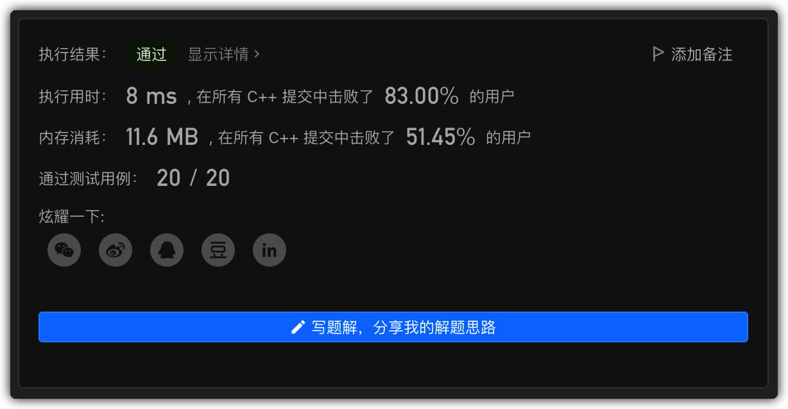

### 20220509 7.6 [239. Sliding Window Maximum](https://leetcode.cn/problems/sliding-window-maximum/)

```c++
class Solution {
private:
    class MyQueue {
    public:
        deque<int> que;
        void pop(int value) {
            if (!que.empty() && value == que.front()) {
                que.pop_front();
            }
        }
        void push(int value) {
            while (!que.empty() && value > que.back()) {
                que.pop_back();
            }
            que.push_back(value);
        }
        int front() {
            return que.front();
        }
    };
public:
    vector<int> maxSlidingWindow(vector<int>& nums, int k) {
        MyQueue que;
        vector<int> result;
        for (int i = 0; i < k; i++) {
            que.push(nums[i]);
        }
        result.push_back(que.front());
        for (int i = k; i <nums.size(); i++) {
            que.pop(nums[i - k]);
            que.push(nums[i]);
            result.push_back(que.front());
        }
        return result;
    }
};
```

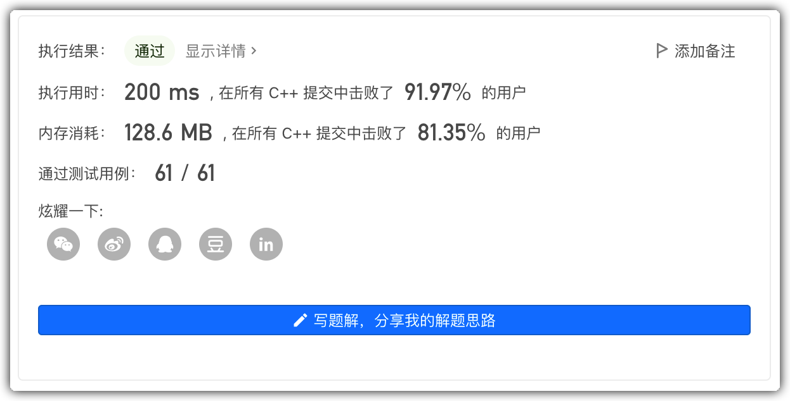

### 20220510 7.7 [347. Top K Frequent Elements](https://leetcode.cn/problems/top-k-frequent-elements/)

```c++
class Solution {
public:
    class mycomparison {
    public:
        bool operator() (const pair<int, int>& lhs, const pair<int, int>& rhs) {
            return lhs.second > rhs.second;
        }
    };
    vector<int> topKFrequent(vector<int>& nums, int k) {
        unordered_map<int, int> map;
        for (int i = 0; i < nums.size(); i++) {
            map[nums[i]]++;
        }
        priority_queue<pair<int, int>, vector<pair<int, int>>, mycomparison> pri_que;
        for (unordered_map<int, int>::iterator it = map.begin(); it != map.end(); it++) {
            pri_que.push(*it);
            if (pri_que.size() > k) {
                pri_que.pop();
            }
        }
        vector<int> result(k);
        for (int i = k - 1; i >= 0; i--) {
            result[i] = pri_que.top().first;
            pri_que.pop();
        }
        return result;
    }
};
```

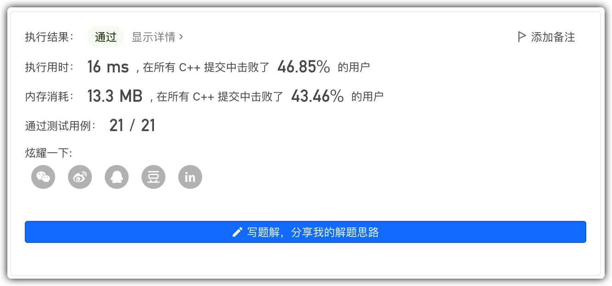

在C++中优先级队列`priority_queue`和`max_heap`的底层实现都是大顶堆。

一开始想到要用大顶堆，但是定义一个大小为k的大顶堆，每次更新的时候都把最大值弹出了，无法保留前k个高频元素。因此考虑使用小顶堆。

### 20220511 [42. Trapping Rain Water](https://leetcode.cn/problems/trapping-rain-water/)

```c++
class Solution {
public:
    int trap(vector<int>& height) {
        if (height.size() <= 2) return 0;
        vector<int> maxLeft(height.size(), 0);
        vector<int> maxRight(height.size(), 0);
        int size = maxRight.size();
        maxLeft[0] = height[0];
        for (int i = 1; i < size; i ++) {
            maxLeft[i] = max(height[i], maxLeft[i - 1]);
        }
        maxRight[size - 1] = height[size - 1];
        for (int i = size - 2; i >= 0; i--) {
            maxRight[i] = max(height[i], maxRight[i + 1]);
        }
        int sum = 0;
        for (int i = 0; i < size; i++) {
            int count = min(maxLeft[i], maxRight[i]) - height[i];
            if (count > 0) sum += count;
        }
        return sum;
    }
};
```

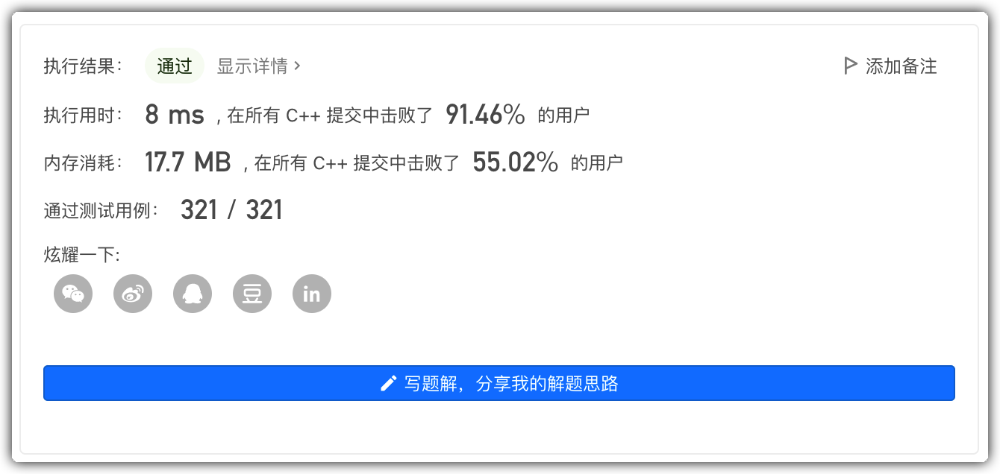

### 20220512 8.1

二叉树：

如果用顺序存储二叉树，如果父节点的下标是i，

那么他的左孩子是$i\times 2 + 1$,右孩子是$i\times 2+2$

遍历：经常会用递归的方式来实现深度优先遍历，也就是实现前序、中序、后序遍历。广度优先遍历主要使用队列的结构实现。

### 20220513 8.2 前中后序的递归遍历

1. 确定递归函数的参数和返回值

   `void traversal(TreeNode* cur, vector<int>& vec)`

   前一个参数是树的当前节点，后一个参数是存放节点数据的数组。

2. 确定终止条件

   当遍历节点为空时，则直接返回。

   `if (cur == NULL) return;`

3. 确定单层递归的逻辑

   ```c++
   //前序
   vec.push_back(cur->val);		//中
   traversal(cur->left, vec);	//左
   traversal(cur->right, vec);	//右
   //中序
   traversal(cur->left, vec);	//左
   vec.push_back(cur->val);		//中
   traversal(cur->right, vec);	//右
   //后序
   traversal(cur->left, vec);	//左
   traversal(cur->right, vec);	//右
   vec.push_back(cur->val);		//中
   ```

   

### 20220516 8.3 前中后序的迭代遍历

前序 [144. Binary Tree Preorder Traversal](https://leetcode.cn/problems/binary-tree-preorder-traversal/)

```c++
class Solution {
public:
    vector<int> preorderTraversal(TreeNode* root) {
        stack<TreeNode*> st;
        vector<int> result;
        if (root == NULL) return result;
        st.push(root);
        while (!st.empty()) {
            TreeNode* node = st.top();
            st.pop();
            result.push_back(node->val);
            if (node->right) st.push(node->right);
            if (node->left) st.push(node->left);
        }
        return result;

    }
};
```

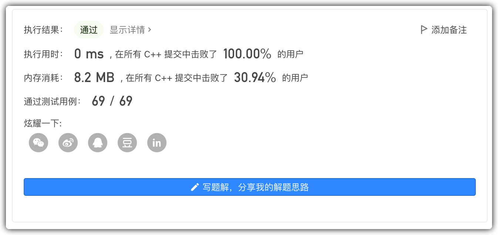

中序 [94. Binary Tree Inorder Traversal](https://leetcode.cn/problems/binary-tree-inorder-traversal/)

```c++
class Solution {
public:
    vector<int> inorderTraversal(TreeNode* root) {
        vector<int> result;
        stack<TreeNode*> st;
        TreeNode* cur = root;
        while (cur != NULL || !st.empty()) {
            if (cur != NULL) {
                st.push(cur);
                cur = cur->left;
            } else {
                cur = st.top();
                st.pop();
                result.push_back(cur->val);
                cur = cur->right;
            }
        }
        return result;
    }
};
```

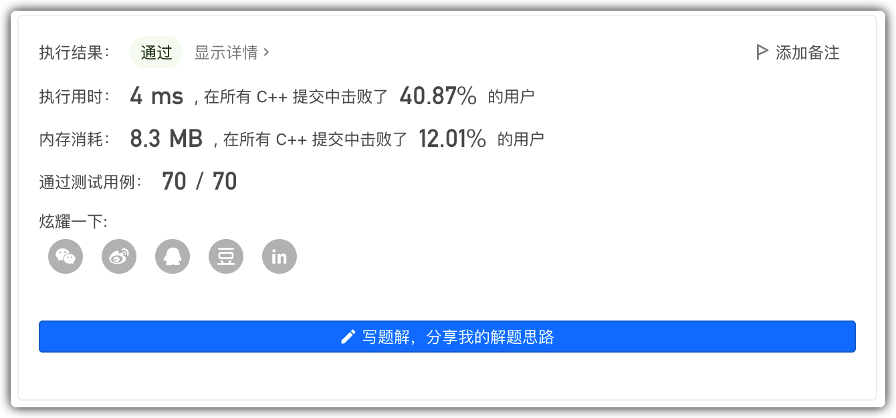

后序 [145. Binary Tree Postorder Traversal](https://leetcode.cn/problems/binary-tree-postorder-traversal/)

```c++
class Solution {
public:
    vector<int> postorderTraversal(TreeNode* root) {
        stack<TreeNode*> st;
        vector<int> result;
        if (root == NULL) return result;
        st.push(root);
        while (!st.empty()) {
            TreeNode* node = st.top();
            st.pop();
            result.push_back(node->val);
            if (node->left) st.push(node->left);
            if (node->right) st.push(node->right);
        }
        reverse(result.begin(), result.end());
        return result;
    }
};
```

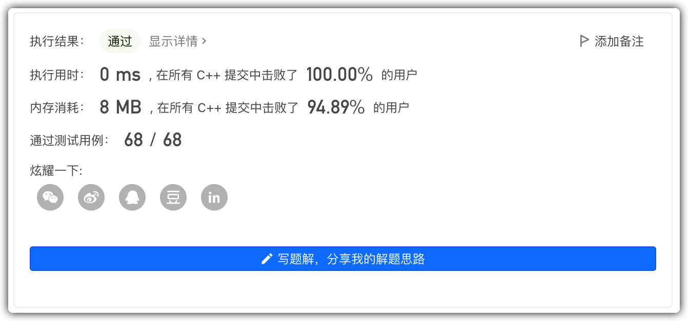
