# LeetCode Everyday

## 简介

这个文件夹用来存放每天做的Leetcode学到的内容。也许会把这个内容同步到博客上。

[toc]

## 2022年1月

### 20220124 [448. Find All Numbers Disappeared in an Array](https://leetcode-cn.com/problems/find-all-numbers-disappeared-in-an-array/)

```c++
class Solution {
public:
    vector<int> findDisappearedNumbers(vector<int>& nums) {
        vector<int> ans;
        for (const int & num: nums) {
            int pos = abs(num) - 1;
            if (nums[pos] > 0) {
                nums[pos] = -nums[pos];
            }
        }
        for (int i = 0; i < nums.size(); ++i) {
            if (nums[i] > 0) {
                ans.push_back(i + 1);
            }
        }
        return ans;
    }
};
```


今天这道题，利用hash表，把所有重复出现的位置进行标记，再遍历一遍就可以找到没有出现过的数字。  
进阶题目要求原地hash，可以直接对原数组进行标记，把重复出现的数字标为负数。最后遍历，仍是正数的就是没有出现过的数字。

### 20220125 [48. Rotate Image](https://leetcode-cn.com/problems/rotate-image/)

```c++
class Solution {
public:
    void rotate(vector<vector<int>>& matrix) {
        int temp = 0, n = matrix.size() - 1;
        for (int i = 0; i <= n / 2; ++i) {
            for (int j = i; j < n - i; ++j) {
                temp = matrix[j][n-i];
                matrix[j][n-i] = matrix[i][j];
                matrix[i][j] = matrix[n-j][i];
                matrix[n-j][i] = matrix[n-i][n-j];
                matrix[n-i][n-j] = temp;
            }
        }
    }
};
```


利用很巧妙的方法，可以一次循环内转移点对称的四个值，空间复杂度可以做到常数。

 [如下图题解所示](https://leetcode-cn.com/problems/rotate-image/solution/48-xuan-zhuan-tu-xiang-fu-zhu-ju-zhen-yu-jobi/)


### 20220126 [240. Search a 2D Matrix II](https://leetcode-cn.com/problems/search-a-2d-matrix-ii/)

```c++
class Solution {
public:
    bool searchMatrix(vector<vector<int>>& matrix, int target) {
        int m = matrix.size();
        if (m == 0) {
            return false;
        }
        int n = matrix[0].size();
        int i = 0, j = n - 1;
        while (i < m && j >= 0) {
            if (matrix[i][j] == target) {
                return true;
            } else if (matrix[i][j] > target) {
                --j;
            } else {
                ++i;
            }
        }
        return false;
    }
};
```


今天这道题比较简单，因为每行每列都是增序的，因此只要判断，若当前值小于target那么就向下移动一位，如果大于则向左移动一位。如果直到右下角都没有，那么就不存在。


### 20220127 [769. Max Chunks To Make Sorted](https://leetcode-cn.com/problems/max-chunks-to-make-sorted/) 

```c++
class Solution {
public:
    int maxChunksToSorted(vector<int>& arr) {
        int chunks = 0, cur_max = 0;
        for (int i = 0; i < arr.size(); ++i) {
            cur_max = max (cur_max, arr[i]);
            if (cur_max == i) {
                ++chunks;
            }
        }
        return chunks;
    }
};
```


一开始没读懂题目要干什么,原来是要拆分出一些逆序数字。如果当前最大值大于数组的标号，则说明右边一定有小于数组位置的数字。

### 20220128 [232. Implement Queue using Stacks](https://leetcode-cn.com/problems/implement-queue-using-stacks/)

```c++
class MyQueue {
    stack<int> in, out;
public:
    MyQueue() {}
    void inToOut() {
        if (out.empty()) {
            while (!in.empty()) {
                int x = in.top();
                in.pop();
                out.push(x);
            }
        }
    }
    
    void push(int x) {
        in.push(x);
    }
    
    int pop() {
        inToOut();
        int x = out.top();
        out.pop();
        return x;
    }
    
    int peek() {
        inToOut();
        return out.top();
    }
    
    bool empty() {
        return in.empty() && out.empty();
    }
};

/**
 * Your MyQueue object will be instantiated and called as such:
 * MyQueue* obj = new MyQueue();
 * obj->push(x);
 * int param_2 = obj->pop();
 * int param_3 = obj->peek();
 * bool param_4 = obj->empty();
 */
```


尝试用栈实现一个队列（怎么会有这么怪的需求）

用了两个栈，一个表示输入一个表示输出，用一个inToOut函数把栈内的数据反转存放在out。

### 20220131 [155. Min Stack](https://leetcode-cn.com/problems/min-stack/)

```c++
class MinStack {
    stack<int> s, min_s;
public:
    MinStack() {}
    
    void push(int val) {
        s.push(val);
        if (min_s.empty() || min_s.top() >= val) {
            min_s.push(val);
        }
    }
    
    void pop() {
        if (!min_s.empty() && min_s.top() == s.top()) {
            min_s.pop();
        }
        s.pop();
    }
    
    int top() {
        return s.top();
    }
    
    int getMin() {
        return min_s.top();
    }
};

/**
 * Your MinStack object will be instantiated and called as such:
 * MinStack* obj = new MinStack();
 * obj->push(val);
 * obj->pop();
 * int param_3 = obj->top();
 * int param_4 = obj->getMin();
 */
```


相当于额外建立了一个栈`min_s`，`min_s`的栈顶是原来栈里所有值里的最小值。

## 2022年2月

### 20220201 [20. Valid Parentheses](https://leetcode-cn.com/problems/valid-parentheses/)

```c++
class Solution {
public:
    bool isValid(string s) {
        stack<char> parsed;
        for (int i = 0; i < s.length(); ++i) {
            if (s[i] == '{' || s[i] == '[' || s[i] == '(') {
                parsed.push(s[i]);
            } else {
                if (parsed.empty()) {
                    return false;
                }
                char c = parsed.top();
                if ((s[i] == '}' && c == '{') ||
                    (s[i] == ']' && c == '[') ||
                    (s[i] == ')' && c == '(')) {
                        parsed.pop();
                    } else {
                        return false;
                    }
            }
        }
        return parsed.empty();
    }
};
```


一道典型的应用栈的题目，遇到左括号时候入栈，遇到右括号时候出栈。这个可能也就是形式语言与自动机的CFL/PDA吧。

### 20220202 [739. Daily Temperatures](https://leetcode-cn.com/problems/daily-temperatures/)

```c++
class Solution {
public:
    vector<int> dailyTemperatures(vector<int>& temperatures) {
        int n = temperatures.size();
        vector<int> ans(n);
        stack<int> indices;
        for (int i = 0; i < n; ++i) {
            while (!indices.empty()) {
                int pre_index = indices.top();
                if (temperatures[i] <= temperatures[pre_index]) {
                    break;
                }
                indices.pop();
                ans[pre_index] = i - pre_index;
            }
            indices.push(i);
        }
        return ans;
    }
};
```


这道题用单调栈解决。用单调递减的栈表示每天的温度。

### 20220203 [23. Merge k Sorted Lists](https://leetcode-cn.com/problems/merge-k-sorted-lists/)

```c++
/**
 * Definition for singly-linked list.
 * struct ListNode {
 *     int val;
 *     ListNode *next;
 *     ListNode() : val(0), next(nullptr) {}
 *     ListNode(int x) : val(x), next(nullptr) {}
 *     ListNode(int x, ListNode *next) : val(x), next(next) {}
 * };
 */
class Solution {
public:
    struct Comp {
        bool operator() (ListNode* l1, ListNode* l2) {
            return l1->val > l2->val;
        }
    };
    ListNode* mergeKLists(vector<ListNode*>& lists) {
        if (lists.empty()) return nullptr;
        priority_queue<ListNode*, vector<ListNode*>, Comp>  q;
        for (ListNode* list: lists) {
            if (list) {
                q.push(list);
            }
        }
        ListNode* dummy = new ListNode(0), *cur = dummy;
        while (!q.empty()) {
            cur -> next = q.top();
            q.pop();
            cur = cur -> next;
            if (cur->next) {
                q.push(cur->next);
            }
        }
        return dummy->next;
    }
};
```


今天这道题乍看上去觉得不怎么难，但是想要速度快一点，就需要考虑用到优先队列。考虑用最小堆实现。

### 20220204 [218. The Skyline Problem](https://leetcode-cn.com/problems/the-skyline-problem/)

```c++
class Solution {
public:
    vector<vector<int>> getSkyline(vector<vector<int>>& buildings) {
        auto cmp = [](const pair<int, int>& a, const pair<int, int>& b) -> bool { return a.second < b.second; };
        priority_queue<pair<int, int>, vector<pair<int, int>>, decltype(cmp)> que(cmp);

        vector<int> boundaries;
        for (auto& building : buildings) {
            boundaries.emplace_back(building[0]);
            boundaries.emplace_back(building[1]);
        }
        sort(boundaries.begin(), boundaries.end());

        vector<vector<int>> ret;
        int n = buildings.size(), idx = 0;
        for (auto& boundary : boundaries) {
            while (idx < n && buildings[idx][0] <= boundary) {
                que.emplace(buildings[idx][1], buildings[idx][2]);
                idx++;
            }
            while (!que.empty() && que.top().first <= boundary) {
                que.pop();
            }

            int maxn = que.empty() ? 0 : que.top().second;
            if (ret.size() == 0 || maxn != ret.back()[1]) {
                ret.push_back({boundary, maxn});
            }
        }
        return ret;
    }
};
```


自己按照优先队列扫描，存储每个建筑物的高度和右端，最后只过了35/40个测试用例。怎么调试都找不出问题，最后抄了官方题解。

### 20220207 [239. Sliding Window Maximum](https://leetcode-cn.com/problems/sliding-window-maximum/)

```c++
class Solution {
public:
    vector<int> maxSlidingWindow(vector<int>& nums, int k) {
        deque<int> dq;
        vector<int> ans;
        for (int i = 0; i < nums.size(); ++i) {
            if (!dq.empty() && dq.front() == i - k) {
                dq.pop_front();
            }
            while (!dq.empty() && nums[dq.back()] < nums[i]) {
                dq.pop_back();
            }
            dq.push_back(i);
            if (i >= k - 1) {
                ans.push_back(nums[dq.front()]);
            }
        }
        return ans;
    }
};
```


使用单调队列即可。push时要把前面比自己小的元素都删掉，直到遇到更大的元素才停止删除。难点在于如何写这样一个单调队列。

### 20220208 [1. Two Sum](https://leetcode-cn.com/problems/two-sum/)

```c++
class Solution {
public:
    vector<int> twoSum(vector<int>& nums, int target) {
        unordered_map<int, int> hash;
        vector<int> ans;
        for (int i = 0; i < nums.size(); ++i) {
            int num = nums[i];
            auto pos = hash.find(target - num);
            if (pos == hash.end()) {
                hash[num] = i;
            } else {
                ans.push_back(pos->second);
                ans.push_back(i);
                break;
            }
        }
        return ans;
    }
};
```


通过哈希表存储遍历过的值，每次遍历到`i`的时候，查看hashtable里有没有`target-nums[i]`

### 20220209 [128. Longest Consecutive Sequence](https://leetcode-cn.com/problems/longest-consecutive-sequence/)

```c++
class Solution {
public:
    int longestConsecutive(vector<int>& nums) {
        unordered_set<int> hash;
        for (const int & num: nums) {
            hash.insert(num);
        }
        int ans = 0;
        while (!hash.empty()) {
            int cur = *(hash.begin());
            hash.erase(cur);
            int next = cur + 1, prev = cur - 1;
            while (hash.count(next)) {
                hash.erase(next++);
            }
            while (hash.count(prev)) {
                hash.erase(prev--);
            }
            ans = max(ans, next - prev -1);
        }
        return ans;
    }
}
```


今天的题目可以用hash表解决，在hash table不空的条件下，判断hash table的cur指针的前后项是否存在，若存在则计数。

### 20220210 [149. Max Points on a Line](https://leetcode-cn.com/problems/max-points-on-a-line/)

```c++
//leetcode official solution
class Solution {
public:
    int gcd(int a, int b) {
        return b ? gcd(b, a % b) : a;
    }

    int maxPoints(vector<vector<int>>& points) {
        int n = points.size();
        if (n <= 2) {
            return n;
        }
        int ret = 0;
        for (int i = 0; i < n; i++) {
            if (ret >= n - i || ret > n / 2) {
                break;
            }
            unordered_map<int, int> mp;
            for (int j = i + 1; j < n; j++) {
                int x = points[i][0] - points[j][0];
                int y = points[i][1] - points[j][1];
                if (x == 0) {
                    y = 1;
                } else if (y == 0) {
                    x = 1;
                } else {
                    if (y < 0) {
                        x = -x;
                        y = -y;
                    }
                    int gcdXY = gcd(abs(x), abs(y));
                    x /= gcdXY, y /= gcdXY;
                }
                mp[y + x * 20001]++;
            }
            int maxn = 0;
            for (auto& [_, num] : mp) {
                maxn = max(maxn, num + 1);
            }
            ret = max(ret, maxn);
        }
        return ret;
    }
};
```


今天这道题和题解的思路一模一样，但是就是通不过，找了半天也没找到原因，粘贴了官方题解的代码顺利通过了。怪事情。

### 20220211 [332. Reconstruct Itinerary](https://leetcode-cn.com/problems/reconstruct-itinerary/)

```c++
class Solution {
private:
    unordered_map<string, map<string, int>> targets;
    bool backtracking(int ticketNum, vector<string>& result) {
        if (result.size() == ticketNum + 1) {
            return true;
        }
        for (pair<const string, int>& target : targets[result[result.size() - 1]]) {
            if (target.second > 0) {
                result.push_back(target.first);
                target.second--;
                if (backtracking(ticketNum, result)) return true;
                result.pop_back();
                target.second++;
            }
        }
        return false;
    }

public:
    vector<string> findItinerary(vector<vector<string>>& tickets) {
        targets.clear();
        vector<string> result;
        for (const vector<string>& vec : tickets) {
            targets[vec[0]][vec[1]]++;
        }
        result.push_back("JFK");
        backtracking(tickets.size(), result);
        return result;
    }
};
```


深搜使用回溯的思想解决。难点在于如何处理死循环。

### 20220214 [303. Range Sum Query - Immutable](https://leetcode-cn.com/problems/range-sum-query-immutable/)

```c++
class NumArray {
    vector<int> psum;
public:
    NumArray(vector<int>& nums): psum(nums.size() + 1, 0){
        partial_sum(nums.begin(), nums.end(), psum.begin() + 1);
    }
    
    int sumRange(int left, int right) {
        return psum[right+1] - psum[left];
    }
};

/**
 * Your NumArray object will be instantiated and called as such:
 * NumArray* obj = new NumArray(nums);
 * int param_1 = obj->sumRange(left,right);
 */
```


建立数组`psum`存储`nums`每个位置之前所有数字的和。

### 20220215 [304. Range Sum Query 2D - Immutable](https://leetcode-cn.com/problems/range-sum-query-2d-immutable/)

```c++
class NumMatrix {
    vector<vector<int>> integral;
public:
    NumMatrix(vector<vector<int>>& matrix) {
        int m = matrix.size(), n = m > 0? matrix[0].size(): 0;
        integral = vector<vector<int>>(m + 1, vector<int>(n + 1,0));
        for (int i = 1; i <= m; ++i) {
            for (int j = 1; j <= n; ++j) {
                integral[i][j] = matrix[i-1][j-1] + integral[i-1][j] +  integral[i][j-1]- integral[i-1][j-1];
            }
        }
    }
    
    int sumRegion(int row1, int col1, int row2, int col2) {
        return integral[row2+1][col2+1] - integral[row2+1][col1] - integral[row1][col2+1] + integral[row1][col1]; 
    }
};

/**
 * Your NumMatrix object will be instantiated and called as such:
 * NumMatrix* obj = new NumMatrix(matrix);
 * int param_1 = obj->sumRegion(row1,col1,row2,col2);
 */
```


这道题用到了积分图，也就是昨天那道题使用的前缀和的二维版本。可以维护一个二维 `preSum` 数组，专门记录以原点为顶点的矩阵的元素之和，就可以用几次加减运算算出任何一个子矩阵的元素和。

### 20220216 [560. Subarray Sum Equals K](https://leetcode-cn.com/problems/subarray-sum-equals-k/)

```c++
class Solution {
public:
    int subarraySum(vector<int>& nums, int k) {
        int count = 0, psum = 0;
        unordered_map<int, int> hashmap;
        hashmap[0] = 1;
        for (int i: nums) {
            psum += i;
            count += hashmap[psum-k];
            ++hashmap[psum];
        }
        return count;
    }

};
```

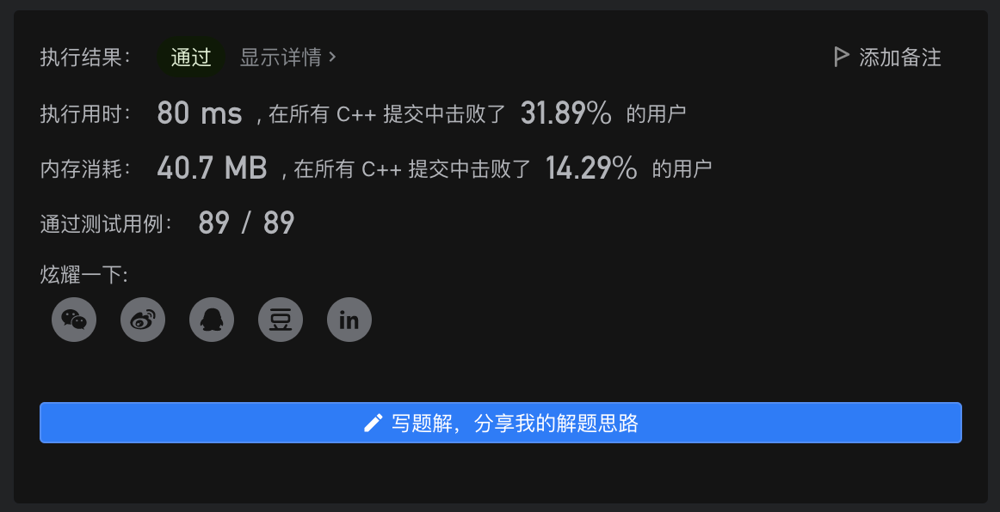

同样利用前缀和。使用hashmap，值为该前缀和出现的次数。

### 20220217 [566. Reshape the Matrix](https://leetcode-cn.com/problems/reshape-the-matrix/)

```c++
class Solution {
public:
    vector<vector<int>> matrixReshape(vector<vector<int>>& mat, int r, int c) {
        int m = mat.size();
        int n = mat[0].size();
        if (m * n != r * c) {
            return mat;
        }
        vector<vector<int>> ans(r, vector<int>(c));
        for (int x = 0; x < m * n; ++x) {
            ans[x / c][x % c] = mat[x / n][x % n];
        }
        return ans;
    }
};
```

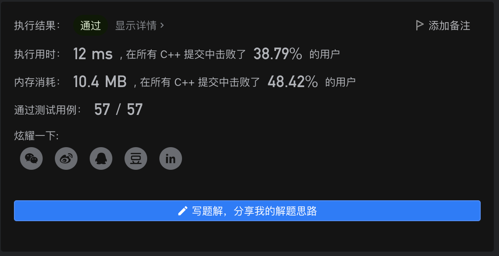

终于遇到了一道简单的题目，但是需要一些耐心处理。

### 20220218 [255. Verify Preorder Sequence in Binary Search Tree](https://leetcode-cn.com/problems/verify-preorder-sequence-in-binary-search-tree/)

```c++
class Solution {
public:
    bool verifyPreorder(vector<int>& preorder) {
        stack<int> stk;
        int lastv = INT_MIN;
        for (int &i : preorder) {
            while (!stk.empty() && stk.top() < i) {
                lastv = stk.top();
                stk.pop();
            }
            if (i < lastv) return false;
            stk.emplace(i);
        }
        return true;
    }
};
```


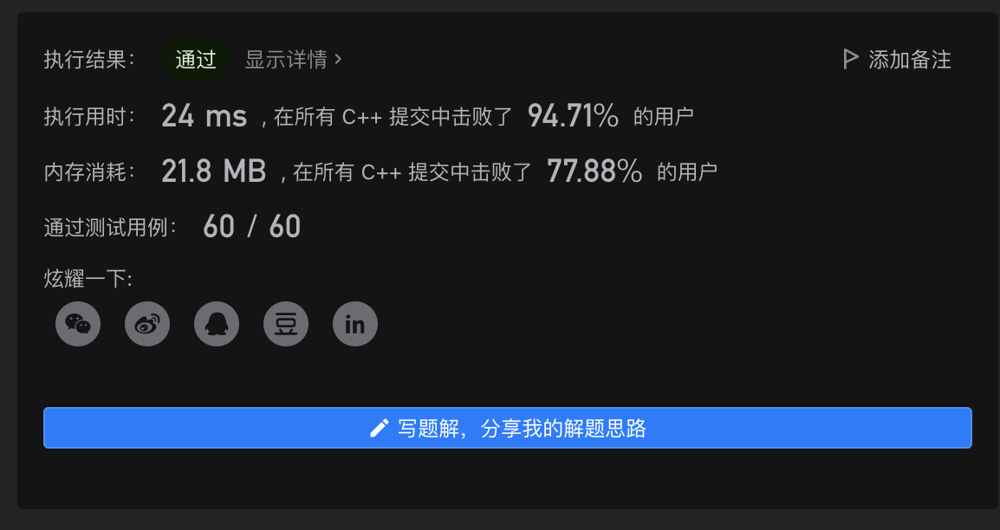

使用单调栈解决，因为中序遍历时，第一次需要一直向左遍历，这时序列是单调递减的。

如果检测到某次入栈元素小于上一次出栈元素，则说明不是二叉搜索树

### 202220221 [503. Next Greater Element II](https://leetcode-cn.com/problems/next-greater-element-ii/)

```c++
class Solution {
public:
    vector<int> nextGreaterElements(vector<int>& nums) {
        int n = nums.size();
        vector<int> res(n);
        stack<int> s;
        for (int i = 2 * n - 1; i >= 0; i--) {
        while (!s.empty() && s.top() <= nums[i % n]) {
            s.pop();
        }
        res[i % n] = s.empty() ? -1 : s.top();
        s.push(nums[i % n]);
        }
        return res;
    }
};
```

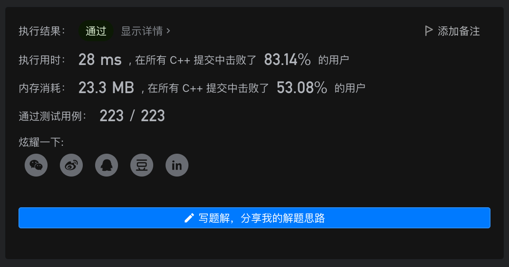

又是使用单调栈的一题，利用循环数组的技巧来模拟数组长度翻倍的效果。

### 20220222 [217. Contains Duplicate](https://leetcode-cn.com/problems/contains-duplicate/)

```c++
class Solution {
public:
    bool containsDuplicate(vector<int>& nums) {
         unordered_set<int> hash;
         for (int x: nums) {
             if (hash.find(x) != hash.end()) {
                 return true;
             }
             hash.insert(x);
         }
         return false;
    }
};
```

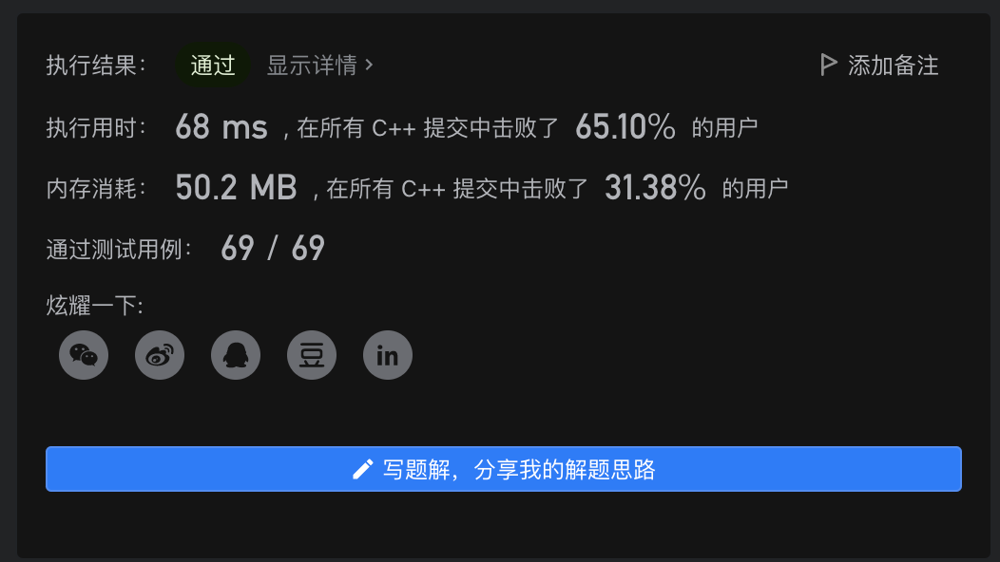

这道题之前就做过一次，之前是使用排序法，这次使用了hashtable来存储，如果插入一个元素时发现该元素已经存在于哈希表中，则说明存在重复的元素。

### 20220223 [697. Degree of an Array](https://leetcode-cn.com/problems/degree-of-an-array/)

```c++
class Solution {
public:
    int findShortestSubArray(vector<int>& nums) {
        unordered_map<int, vector<int>> hash;
        int n = nums.size();
        for (int i = 0; i < n; i++) {
            if (hash.count(nums[i])) {
                hash[nums[i]][0]++;
                hash[nums[i]][2] = i;
            } else {
                hash[nums[i]] = {1, i, i};
            }
        }
        int maxNum = 0, minLen = 0;
        for (auto& [_, vec] : hash) {
            if (maxNum < vec[0]) {
                maxNum = vec[0];
                minLen = vec[2] - vec[1] + 1;
            } else if (maxNum == vec[0]) {
                if (minLen > vec[2] - vec[1] + 1) {
                    minLen = vec[2] - vec[1] + 1; 
                }
            }
        }
    return minLen;
    }
};
```


使用哈希表实现，每一个数映射到一个长度为3的数组，数组中的三个元素分别代表这个数出现的次数、这个数在原数组中第一次出现的位置、这个数在原数组中最后一次出现的位置。当我们记录完所有信息后，我们需要遍历该哈希表，找到元素出现次数最多，且前后位置差最小的数。

### 20220224 [594. Longest Harmonious Subsequence](https://leetcode-cn.com/problems/longest-harmonious-subsequence/)

```c++
class Solution {
public:
    int findLHS(vector<int>& nums) {
        sort(nums.begin(), nums.end());
        int begin = 0;
        int res = 0;
        for (int end = 0; end < nums.size(); end++) {
            while (nums[end] - nums[begin] > 1) {
                begin++;
            }
            if (nums[end] - nums[begin] == 1) {
                res = max(res, end - begin + 1);
            }
        }
        return res;
    }
};
```

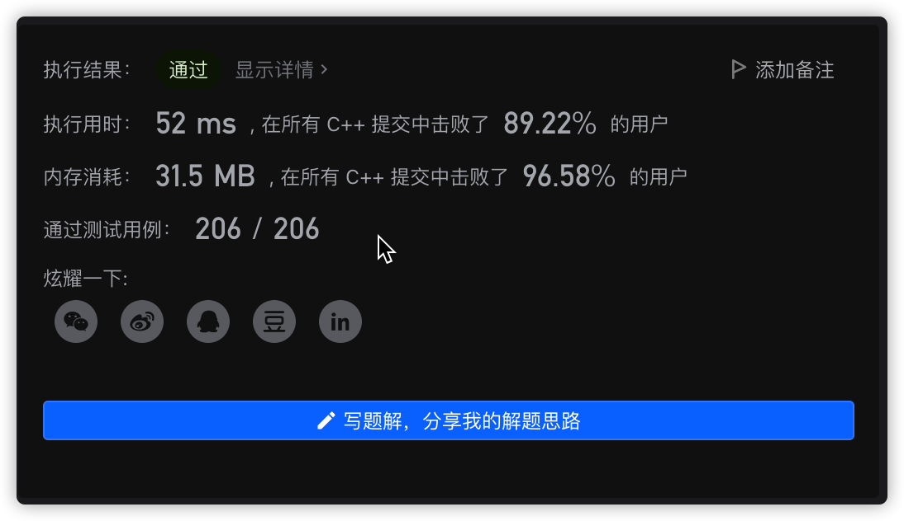

将数组按照从小到大进行排序，我们只需要依次找到相邻两个连续相同元素的子序列，检查该这两个子序列的元素的之差是否为 1

### 20220225 [287. Find the Duplicate Number](https://leetcode-cn.com/problems/find-the-duplicate-number/)

```c++
class Solution {
public:
    int findDuplicate(vector<int>& nums) {
        int n = nums.size();
        int l = 1, r = n - 1, ans = -1;
        while (l <= r) {
            int mid = (l + r) >> 1;
            int cnt = 0;
            for (int i = 0; i < n; ++i) {
                cnt += nums[i] <= mid;
            }
            if (cnt <= mid) {
                l = mid + 1;
            } else {
                r = mid - 1;
                ans = mid;
            }
        }
        return ans;
    }
};
```

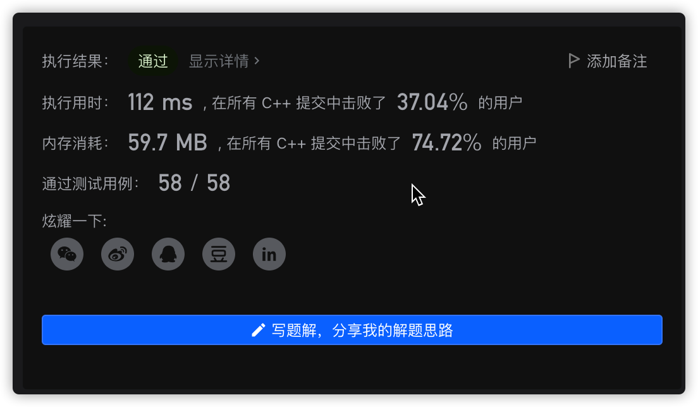

### 20220228 [313. Super Ugly Number](https://leetcode-cn.com/problems/super-ugly-number/)

```c++
class Solution {
public:
    int nthSuperUglyNumber(int n, vector<int>& primes) {
        vector<long> dp(n+1);
        int m = primes.size();
        vector<int> pointers(m, 0);
        vector<long> nums(m, 1);
        for (int i = 1; i <= n; i++) {
            long minNum = INT_MAX;
            for(int j = 0; j < m; j++){
                minNum = min(minNum, nums[j]);
            }
            dp[i] = minNum;
            for (int j = 0; j < m; ++j) {
                if (nums[j] == minNum) {
                    pointers[j]++;
                    nums[j] = dp[pointers[j]] * primes[j];
                }
            }
        }
        return dp[n];
    }
};
```

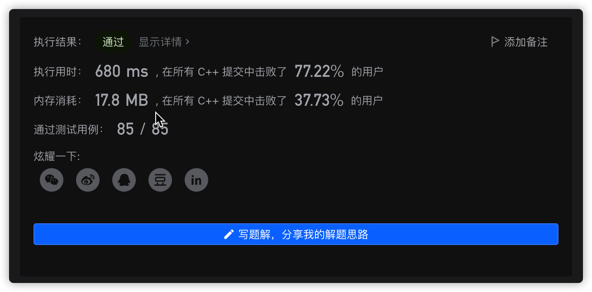

今天这道题没读懂什么意思，直接抄答案了。

### 20220301 [870. Advantage Shuffle](https://leetcode-cn.com/problems/advantage-shuffle/)

```c++
class Solution {
public:
    vector<int> advantageCount(vector<int>& nums1, vector<int>& nums2) {
        int n = nums1.size();

        sort(nums1.begin(), nums1.end(), greater<int>());
        vector<pair<int, int>> sorted2(n);
        for(int i = 0; i < n; i++){
            sorted2[i] = {nums2[i], i};
        }
        sort(sorted2.begin(), sorted2.end(), [](const auto& a, const auto& b){return a.first > b.first;});

        vector<int> res(n);
        int left = 0, right = n - 1;
        for(int i = 0; i < n; i++){
            auto [cur, idx] = sorted2[i];
            if(nums1[left] <= cur) {
                res[idx] = nums1[right];
                right--;
            } else {
                res[idx] = nums1[left];
                left++;
            } 
        }
        return res;
    }
};
```

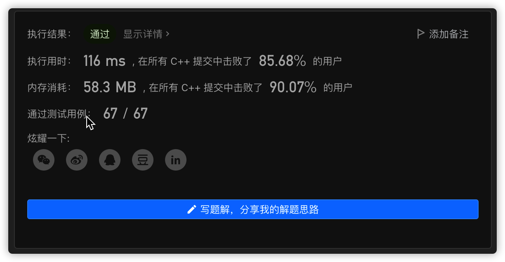

今天这道题，其实是田忌赛马的加强版。nums1就是田忌，nums2就是齐王。使用双指针比较两个排序好的数组即可。

### 20220302 [307. Range Sum Query - Mutable](https://leetcode-cn.com/problems/range-sum-query-mutable/)

```c++
class NumArray {
public:
    int size;
    vector<int> nums;
    vector<int> tree;

    NumArray(vector<int>& nums) {
        size = nums.size();
        this->nums = nums;
        tree.resize(size + 1, 0);
        for (int i = 0; i < size; ++i) {
            add(i + 1, nums[i]);
        }
    }
    
    void update(int index, int val) {
        int delta = val - nums[index];
        add(index + 1, delta);
        nums[index] = val;
    }
    
    int sumRange(int left, int right) {
        int preleft = query(left);
        int preright = query(right + 1);
        return preright - preleft;
    }

    void add(int idx, int delta) {
        while (idx < size +1) {
            tree[idx] += delta;
            idx += lowbit(idx);
        }
    }

    int lowbit(int idx) {
        return idx & (-idx);
    }

    int query(int idx) {
        int sum = 0;
        while (idx > 0) {
            sum += tree[idx];
            idx -= lowbit(idx);
        }
        return sum;
    }
};

/**
 * Your NumArray object will be instantiated and called as such:
 * NumArray* obj = new NumArray(nums);
 * obj->update(index,val);
 * int param_2 = obj->sumRange(left,right);
 */
```

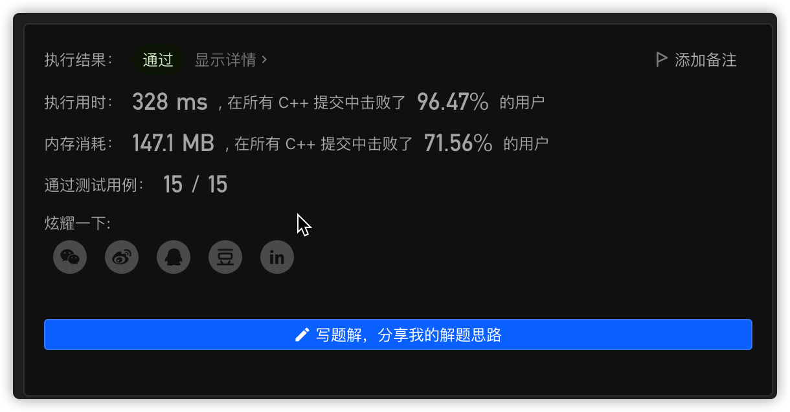

这道题主要涉及到树状数组。通过看了许多材料了解了树状数组的概念。

### 20220303 [242. Valid Anagram](https://leetcode-cn.com/problems/valid-anagram/)

```c++
class Solution {
public:
    bool isAnagram(string s, string t) {
        if (s.length() != t.length()) {
            return false;
        }
        vector<int> counts(26,0);
        for (int  i = 0; i < s.length(); ++i) {
            ++counts[s[i]-'a'];
            --counts[t[i]-'a'];
        }
        for (int i = 0; i< 26; ++i) {
            if (counts[i]) {
                return false;
            }
        }
        return true;
    }
};
```

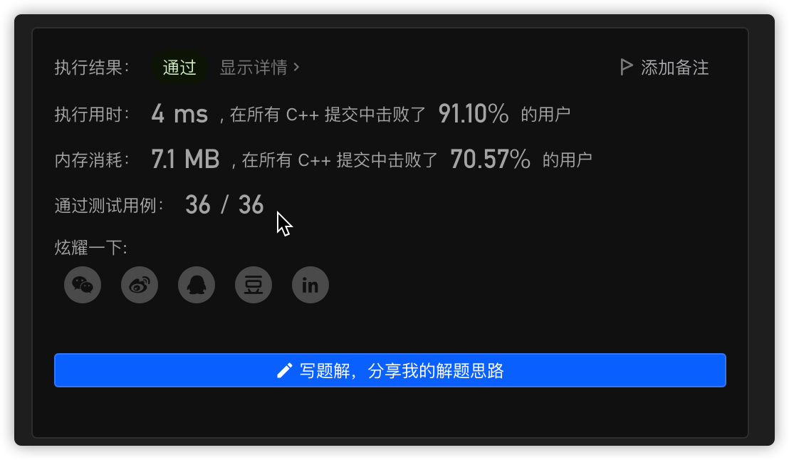

今天这道题没什么难度。匹配好两个数组即可。

### 20220304 [205. Isomorphic Strings](https://leetcode-cn.com/problems/isomorphic-strings/)

```c++
class Solution {
public:
    bool isIsomorphic(string s, string t) {
         unordered_map<char, char> s2t;
        unordered_map<char, char> t2s;
        int len = s.length();
        for (int i = 0; i < len; ++i) {
            char x = s[i], y = t[i];
            if ((s2t.count(x) && s2t[x] != y) || (t2s.count(y) && t2s[y] != x)) {
                return false;
            }
            s2t[x] = y;
            t2s[y] = x;
        }
        return true;
    }
};
```

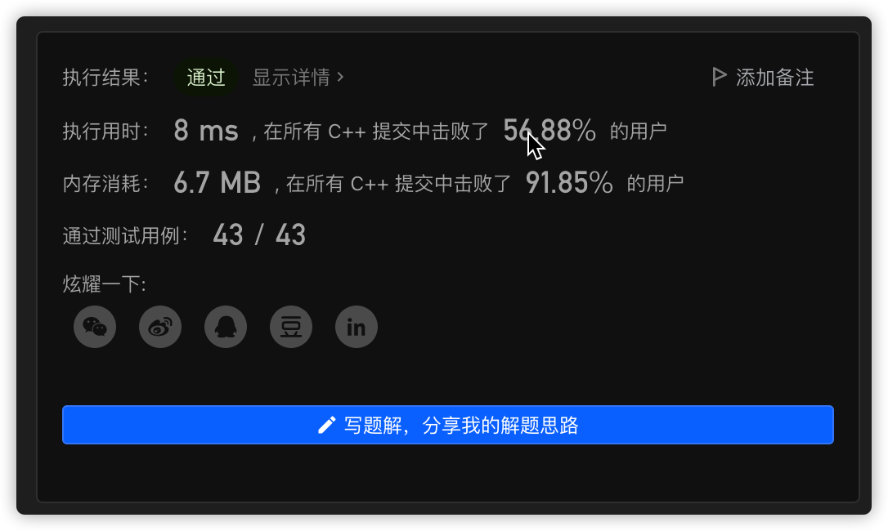

判断两个字符串同构，记录两个字符串每个位置字符第一次出现的位置。若相同，则同构。
