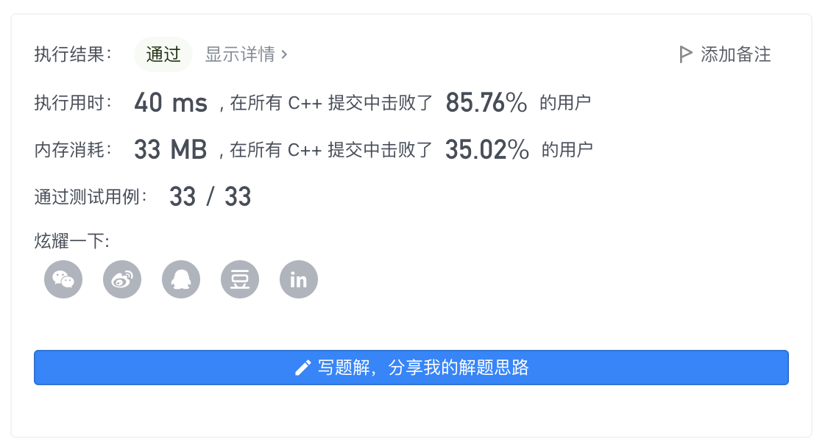

# LeetCode Everyday

## 简介

这个文件夹用来存放每天做的Leetcode学到的内容。也许会把这个内容同步到博客上。

[toc]

## 2022年1月

### 20220124 [448. Find All Numbers Disappeared in an Array](https://leetcode-cn.com/problems/find-all-numbers-disappeared-in-an-array/)

```c++
class Solution {
public:
    vector<int> findDisappearedNumbers(vector<int>& nums) {
        vector<int> ans;
        for (const int & num: nums) {
            int pos = abs(num) - 1;
            if (nums[pos] > 0) {
                nums[pos] = -nums[pos];
            }
        }
        for (int i = 0; i < nums.size(); ++i) {
            if (nums[i] > 0) {
                ans.push_back(i + 1);
            }
        }
        return ans;
    }
};
```



今天这道题，利用hash表，把所有重复出现的位置进行标记，再遍历一遍就可以找到没有出现过的数字。  
进阶题目要求原地hash，可以直接对原数组进行标记，把重复出现的数字标为负数。最后遍历，仍是正数的就是没有出现过的数字。

### 20220125 [48. Rotate Image](https://leetcode-cn.com/problems/rotate-image/)

```c++
class Solution {
public:
    void rotate(vector<vector<int>>& matrix) {
        int temp = 0, n = matrix.size() - 1;
        for (int i = 0; i <= n / 2; ++i) {
            for (int j = i; j < n - i; ++j) {
                temp = matrix[j][n-i];
                matrix[j][n-i] = matrix[i][j];
                matrix[i][j] = matrix[n-j][i];
                matrix[n-j][i] = matrix[n-i][n-j];
                matrix[n-i][n-j] = temp;
            }
        }
    }
};
```


利用很巧妙的方法，可以一次循环内转移点对称的四个值，空间复杂度可以做到常数。

 [如下图题解所示](https://leetcode-cn.com/problems/rotate-image/solution/48-xuan-zhuan-tu-xiang-fu-zhu-ju-zhen-yu-jobi/)


### 20220126 [240. Search a 2D Matrix II](https://leetcode-cn.com/problems/search-a-2d-matrix-ii/)

```c++
class Solution {
public:
    bool searchMatrix(vector<vector<int>>& matrix, int target) {
        int m = matrix.size();
        if (m == 0) {
            return false;
        }
        int n = matrix[0].size();
        int i = 0, j = n - 1;
        while (i < m && j >= 0) {
            if (matrix[i][j] == target) {
                return true;
            } else if (matrix[i][j] > target) {
                --j;
            } else {
                ++i;
            }
        }
        return false;
    }
};
```


今天这道题比较简单，因为每行每列都是增序的，因此只要判断，若当前值小于target那么就向下移动一位，如果大于则向左移动一位。如果直到右下角都没有，那么就不存在。


### 20220127 [769. Max Chunks To Make Sorted](https://leetcode-cn.com/problems/max-chunks-to-make-sorted/) 

```c++
class Solution {
public:
    int maxChunksToSorted(vector<int>& arr) {
        int chunks = 0, cur_max = 0;
        for (int i = 0; i < arr.size(); ++i) {
            cur_max = max (cur_max, arr[i]);
            if (cur_max == i) {
                ++chunks;
            }
        }
        return chunks;
    }
};
```


一开始没读懂题目要干什么,原来是要拆分出一些逆序数字。如果当前最大值大于数组的标号，则说明右边一定有小于数组位置的数字。

### 20220126 [232. Implement Queue using Stacks](https://leetcode-cn.com/problems/implement-queue-using-stacks/)

```c++
class MyQueue {
    stack<int> in, out;
public:
    MyQueue() {}
    void inToOut() {
        if (out.empty()) {
            while (!in.empty()) {
                int x = in.top();
                in.pop();
                out.push(x);
            }
        }
    }
    
    void push(int x) {
        in.push(x);
    }
    
    int pop() {
        inToOut();
        int x = out.top();
        out.pop();
        return x;
    }
    
    int peek() {
        inToOut();
        return out.top();
    }
    
    bool empty() {
        return in.empty() && out.empty();
    }
};

/**
 * Your MyQueue object will be instantiated and called as such:
 * MyQueue* obj = new MyQueue();
 * obj->push(x);
 * int param_2 = obj->pop();
 * int param_3 = obj->peek();
 * bool param_4 = obj->empty();
 */
```


尝试用栈实现一个队列（怎么会有这么怪的需求）

用了两个栈，一个表示输入一个表示输出，用一个inToOut函数把栈内的数据反转存放在out。


